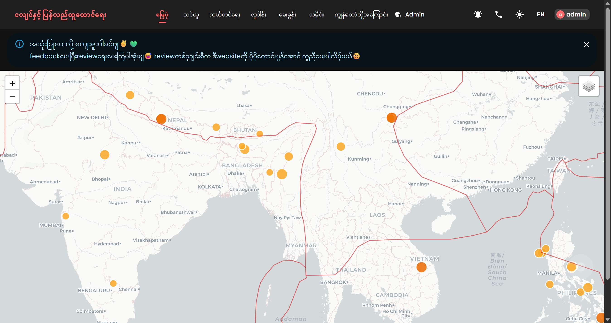
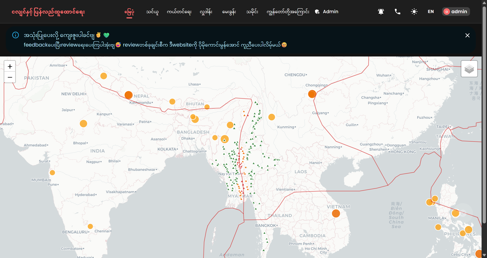
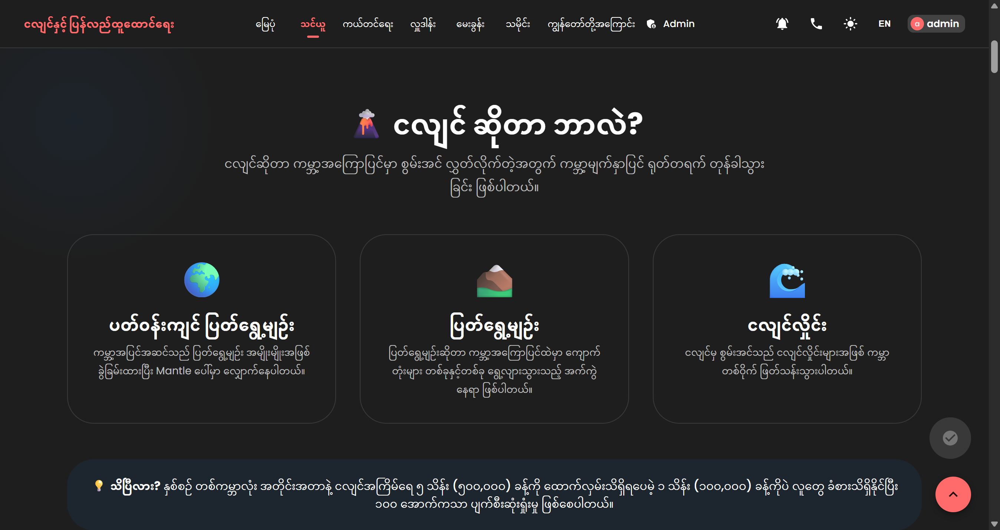
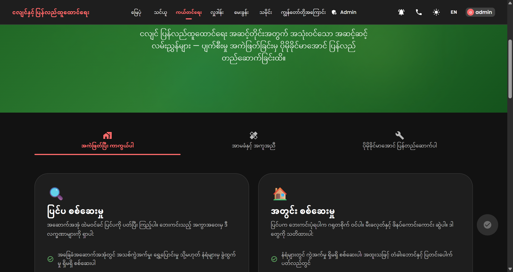
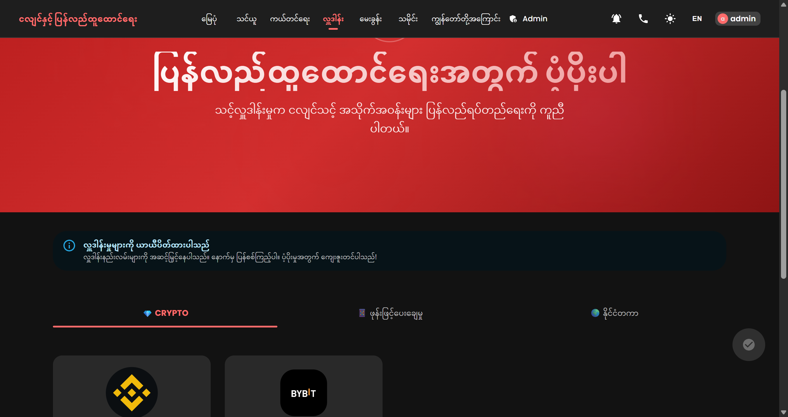
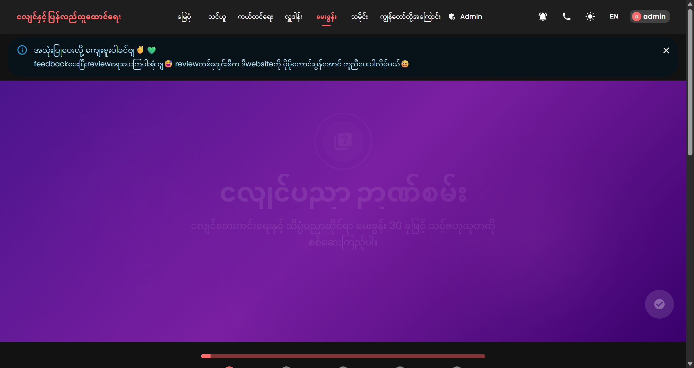
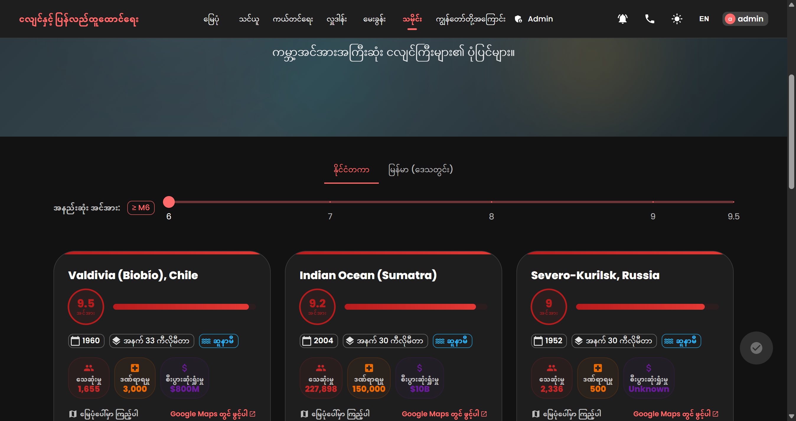
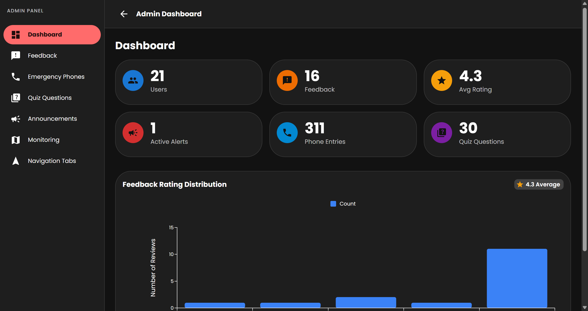
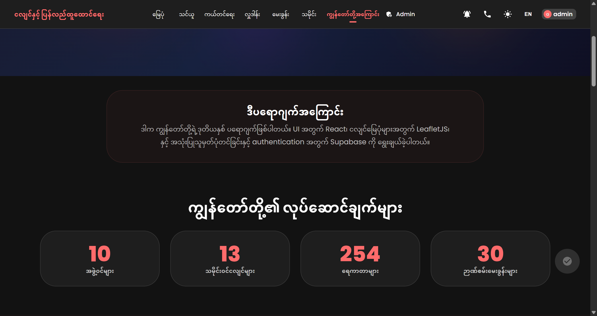

# Earthquake & Recovery

A bilingual (Myanmar / English) single-page app for real-time earthquake tracking, safety education, and recovery resources. Live seismic data from EMSC, Myanmar dam risk assessment, GPS-based alerting with an emergency siren, and Supabase-powered accounts — all in one place.

---

## Features

- **Full-Screen Live Earthquake Map** — The home page is a full-bleed Leaflet map with real-time EMSC data (last 7 days, M1+, refreshed every 30 seconds), color/size-coded magnitude markers rendered on canvas for smooth pan & zoom. Diff-based updates only re-render markers when earthquake IDs actually change.
- **Tectonic Plate Overlay** — Global plate boundary lines rendered as SVG GeoJSON (fetched once, cached indefinitely)
- **Myanmar Dam Risk Assessment** — 254 dams shown with risk levels (red/orange/green) computed via Turf.js distance-to-nearest-plate-boundary analysis
- **Location-Based Earthquake Alerts** — Navbar bell drawer with GPS or saved-location monitoring: alerts on M3+ quakes within 50 km with a 60-second emergency siren, browser notifications, and mobile vibration
  - **Test Alert** button to demo the siren, **Stop Sound** control that actually sticks, and **Reassign Location** (use live GPS position or manual coordinates)
  - Built-in **"How Earthquake Alerts Work"** explainer (P-wave vs S-wave, warning-time physics)
- **Emergency Phone Directory** — City-based emergency contacts across 13 Myanmar cities
- **Announcement Banner** — Admin-managed dismissible banners pulled from Supabase, with severity levels (info, warning, danger)
- **Learn** — Dedicated education page: what earthquakes are, how they're measured, safety guides, and before/during/after checklists (Drop, Cover, Hold On)
- **Recovery Resources** — Short-term, mid-term, and long-term recovery guidance with actionable checklists
- **Historical Earthquakes** — Interactive timeline of major quakes worldwide with images and impact stats
- **Quiz** — 30-question interactive earthquake knowledge test with instant scoring
- **Donate** — Crypto, mobile payment, and international donation options with step-by-step guides
- **About** — Project story, animated stats, tech stack, and team member profiles with enlarged profile pictures
- **Admin Dashboard** — Fully responsive admin panel with sidebar navigation (hamburger drawer on mobile, permanent sidebar on desktop), stats overview with charts, feedback/phones/quiz/announcements management with responsive DataGrids, and earthquake monitoring with adaptive map layout
- **User Accounts** — Register/login with Supabase (instant signup)
- **Bilingual i18n** — Full Myanmar (default) / English translations, persisted in localStorage
- **Dark/Light Mode** — Full MUI theme toggle
- **Responsive** — Mobile drawer navigation, adaptive toolbar, map legend overlay, and fully responsive admin dashboard (sidebar drawer on mobile, responsive DataGrid heights, wrapping dialog forms)

---

## Screenshots

| | |
|---|---|
|  |  |
| **Live earthquake map** — Real-time EMSC data with tectonic boundaries | **Dam risk assessment** — Color-coded markers by proximity to fault lines |
|  |  |
| **Learn** — Earthquake education, safety guides, and how they're measured | **Recovery resources** — Short, mid, and long-term guidance |
|  |  |
| **Donation options** — Crypto, mobile, and international payments | **Knowledge quiz** — 30-question interactive earthquake test |
|  |  |
| **Historical earthquakes** — Major quakes timeline with magnitude filter | **Admin dashboard** — Stats, feedback, and content management |
|  | |
| **About** — Project story, animated stats, and tech stack | |

---

## Quick Start

```bash
# Install dependencies
cd app && npm install

# Start dev server (port 5173)
npm run dev

# Production build -> app/dist/
npm run build
```

Create `app/.env` with your Supabase credentials:

```env
VITE_SUPABASE_URL=https://your-project.supabase.co
VITE_SUPABASE_ANON_KEY=your-anon-key
```

Enable instant signup in Supabase: **Authentication -> Settings -> Email -> Toggle off "Confirm email"**

> No backend is required — auth uses Supabase and earthquake data is fetched directly from the EMSC public API.

---

## Project Structure

```
earthquake-recovery/
├── app/                            # Frontend (React + Vite)
│   ├── index.html
│   ├── vite.config.js
│   ├── public/
│   │   ├── assets/                 # Images + alert-sound.mp3
│   │   ├── tectonicplates.json     # Global tectonic plate boundaries
│   │   └── myanmar_dams.json       # 254 Myanmar dam locations
│   └── src/
│       ├── main.jsx
│       ├── App.jsx                 # Routes (lazy-loaded pages)
│       ├── theme.js                # MUI theme (dark/light palette)
│       ├── index.css               # Global styles + Leaflet overrides
│       ├── i18n/
│       │   ├── index.jsx           # Language context (my default, localStorage)
│       │   ├── en.json             # English translations
│       │   └── my.json             # Myanmar translations
│       ├── components/
│       │   ├── Layout.jsx          # App shell with navbar + footer
│       │   ├── Navbar.jsx          # Sticky nav, mobile drawer, theme/lang/auth
│       │   ├── Footer.jsx
│       │   ├── EarthquakeMap.jsx   # Full-screen Leaflet map — quakes, plates, dams
│       │   ├── LocationAlerts.jsx  # GPS monitoring, siren, notifications, reassign
│       │   ├── LocationAlertsNav.jsx # Navbar bell + drawer (alert settings + knowledge)
│       │   ├── EmergencyPhones.jsx # City-based emergency phone directory
│       │   ├── AuthDialog.jsx      # Supabase login/register dialog
│       │   ├── AnnouncementBanner.jsx # Admin-managed dismissible alert banners
│       │   ├── AnimatedHero.jsx    # Scroll parallax hero with gradient blobs
│       │   ├── AnimatedPage.jsx    # Framer Motion page transition wrapper
│       │   ├── BackToTop.jsx       # Scroll-to-top floating button
│       │   ├── FeedbackButton.jsx  # In-app feedback form
│       │   ├── SectionHeader.jsx   # Reusable section title component
│       │   ├── RequireAdmin.jsx    # Admin route guard
│       │   ├── HomeSkeleton.jsx    # Loading skeleton for home page
│       │   ├── LearnSkeleton.jsx   # Loading skeleton for learn page
│       │   ├── PageSkeleton.jsx    # Loading skeleton for other pages
│       │   ├── SafetyGuide.jsx     # Drop, Cover, Hold On visual guide
│       │   ├── SafetyCharacter.jsx # Animated safety illustration
│       │   ├── BeforeEarthquake.jsx    # Preparedness checklist
│       │   ├── DuringEarthquake.jsx    # Emergency response steps
│       │   ├── AfterEarthquake.jsx     # Post-quake safety
│       │   ├── WhatIsEarthquake.jsx    # Educational intro to quakes
│       │   └── HowToMeasure.jsx        # Seismographs & magnitude scales
│       ├── lib/
│       │   └── supabase.js         # Supabase client config
│       ├── utils/
│       │   └── damRisk.js          # Turf.js distance + risk classification
│       ├── context/
│       │   ├── AuthContext.jsx     # Supabase auth state provider
│       │   └── ThemeContext.jsx    # Dark/light mode provider
│       ├── data/
│       │   ├── emergencyPhones.js  # 13-city emergency contacts
│       │   └── siteSearchData.js   # Site search index
│       └── pages/
│           ├── Home.jsx            # Full-screen live earthquake map
│           ├── Learn.jsx           # Earthquake education hub
│           ├── Recovery.jsx        # Recovery resources
│           ├── Donate.jsx          # Donation options + guides
│           ├── Quiz.jsx            # 30-question interactive quiz
│           ├── History.jsx         # Historical earthquakes timeline
│           ├── About.jsx           # Story, stats, tech stack, team
│           └── admin/
│               ├── AdminLayout.jsx        # Responsive admin shell (drawer sidebar on mobile, permanent on desktop)
│               ├── AdminDashboard.jsx     # Stats overview + charts (responsive card grid)
│               ├── AdminFeedback.jsx      # Feedback management with responsive DataGrid
│               ├── AdminPhones.jsx        # Emergency phone management
│               ├── AdminQuiz.jsx          # Quiz question management (responsive dialog forms)
│               ├── AdminAnnouncements.jsx # Announcement management (responsive dialog forms)
│               ├── AdminMonitoring.jsx    # Earthquake monitoring (responsive map + list layout)
│               ├── AdminNavigation.jsx    # Navigation tab management
│               └── components/
│                   ├── AdminPageHeader.jsx   # Responsive page header (wraps on mobile)
│                   ├── AdminDataGrid.jsx     # Responsive DataGrid wrapper (adaptive height)
│                   ├── ConfirmDialog.jsx     # Reusable confirmation dialog
│                   └── ActionButtons.jsx     # Reusable edit/delete buttons
│               └── hooks/
│                   ├── index.js             # Hook exports
│                   └── useAdminCrud.js      # Shared CRUD operations (create, edit, delete)
│
├── supabase/
│   └── locations.sql               # Database schema + RLS policies
│
├── screenshots/                    # App screenshots (README references)
└── CLAUDE.md
```

---

## Tech Stack

| Layer | Technology |
|-------|-----------|
| Frontend | React 19, Vite 8, MUI 7, React Router 7 |
| Data fetching | TanStack React Query (30s-polled earthquake cache, diff-based marker updates) |
| Maps | Leaflet + react-leaflet 5, CartoDB Positron tiles |
| Spatial Analysis | Turf.js (nearest-point-on-line distance calculation, risk zones) |
| Auth & Storage | Supabase (auth, profiles, feedback, announcements, locations, emergency phones, quiz questions) |
| Animations | Framer Motion (page transitions, scroll parallax, staggered reveals) |
| Sound | HTML5 Audio (emergency siren MP3, preload=none for performance) |
| i18n | Custom context + JSON dictionaries (my/en) |

---

## Map Features

- **Data refresh**: Fetches last 7 days of M1+ earthquakes from EMSC every 30 seconds via TanStack Query (shared with the alert monitor)
- **Diff-based markers**: Only re-renders earthquake markers when the set of earthquake IDs actually changes (prevents unnecessary Leaflet DOM updates on every poll)
- **Rendering**: Canvas-based `CircleMarker` for quakes (fast pan/zoom), SVG GeoJSON for tectonic plates
- **Tiles**: Always-light CartoDB Positron street tiles (dark mode only affects the UI chrome)
- **Dam markers**: CSS triangle `DivIcon` colored by risk level (High / Medium / Low)
- **Risk algorithm**: Turf.js `nearestPointOnLine` with bounding-box pre-filter for performance; classification runs on `requestAnimationFrame` to avoid blocking render
- **Risk thresholds**: High <=30 km, Medium <=80 km, Low >80 km from plate boundary (wider thresholds because plate data is a coarse approximation)
- **Caching**: Tectonic plates and dam data fetched once with `staleTime: Infinity` (no redundant re-fetches)

---

## Location Alerts

- **Trigger**: M3+ earthquakes within 50 km of your GPS position or a saved Supabase location
- **Polling**: Reads the shared TanStack Query earthquake cache every 30 seconds
- **Alerting**: Warning snackbar + browser notification + mobile vibration + 60-second looping siren
- **Stop control**: "Stop Sound" permanently stops the current episode — siren only re-arms for a genuinely new event (quake >60 s after the last alerted one)
- **Reassign Location**: Use live GPS position or enter manual coordinates; saved to Supabase with a label
- **Demo mode**: "Test Alert" button plays the full siren flow without a real quake

---

## Admin Dashboard

- **Responsive sidebar**: Permanent drawer on desktop (md+), hamburger-triggered temporary drawer on mobile
- **Responsive stat cards**: 3-column on desktop, 2-column on tablet, single column on mobile
- **Responsive DataGrid**: Adaptive height (400px mobile, 500px desktop) with horizontal scroll for wide tables
- **Responsive dialog forms**: Form fields wrap naturally on small screens (e.g., quiz question options, announcement settings)
- **Adaptive monitoring layout**: Map and location list stack vertically on mobile, side-by-side on desktop
- **Responsive page headers**: Title and action buttons wrap on small screens

---

## i18n

- Myanmar (`my`) is the default language; English (`en`) available via the navbar toggle
- Choice is persisted in `localStorage`; the `<html lang>` attribute updates automatically
- All UI strings live in `app/src/i18n/en.json` / `my.json` and are accessed via a dot-path `t()` helper

---

## Auth & Data

- **Supabase** handles all authentication — no backend server required
- **Instant signup** with email confirmation disabled
- **Locations table** (`supabase/locations.sql`) stores saved monitoring locations with row-level security policies
- **Admin dashboard** at `/admin` — fully responsive with mobile drawer sidebar, adaptive DataGrid heights, and wrapping dialog forms. Tested across mobile (375px), tablet (768px), and desktop (1280px)

---

## Performance Optimizations

- **Lazy loading**: All pages except Home are lazy-loaded via `React.lazy()` with Suspense and loading skeletons
- **Diff-based markers**: Earthquake markers only re-render when the set of IDs changes
- **Preload=none**: Alert sound MP3 is not downloaded until the siren actually triggers (avoids 3.2MB blocking download on page load)
- **Canvas renderer**: Earthquake markers use `L.canvas()` for fast pan/zoom with hundreds of markers
- **Indefinite caching**: Tectonic plates and dam data are fetched once and never re-fetched
- **30s poll interval**: Reduced from 5s to 30s — earthquake data from EMSC updates every ~60s anyway

---

## Data Sources & Credits

- **Earthquake data**: [EMSC](https://www.seismicportal.eu/) (real-time seismic monitoring)
- **Myanmar dams**: [mmeqopendata](https://github.com/akzedevops/mmeqopendata) — Open Development Mekong / IFC / WLE ([CC BY-SA 4.0](https://creativecommons.org/licenses/by-sa/4.0/))
- **Tectonic plates**: [fraxen/tectonicplates](https://github.com/fraxen/tectonicplates)
- **Map tiles**: [OpenStreetMap](https://openstreetmap.org), [CartoDB](https://carto.com/)
- **UI components**: [MUI](https://mui.com/) + [MUI Icons](https://mui.com/material-ui/icons/)
- **Alert sound**: [Pixabay](https://pixabay.com/sound-effects/) — Emergency Warning System
